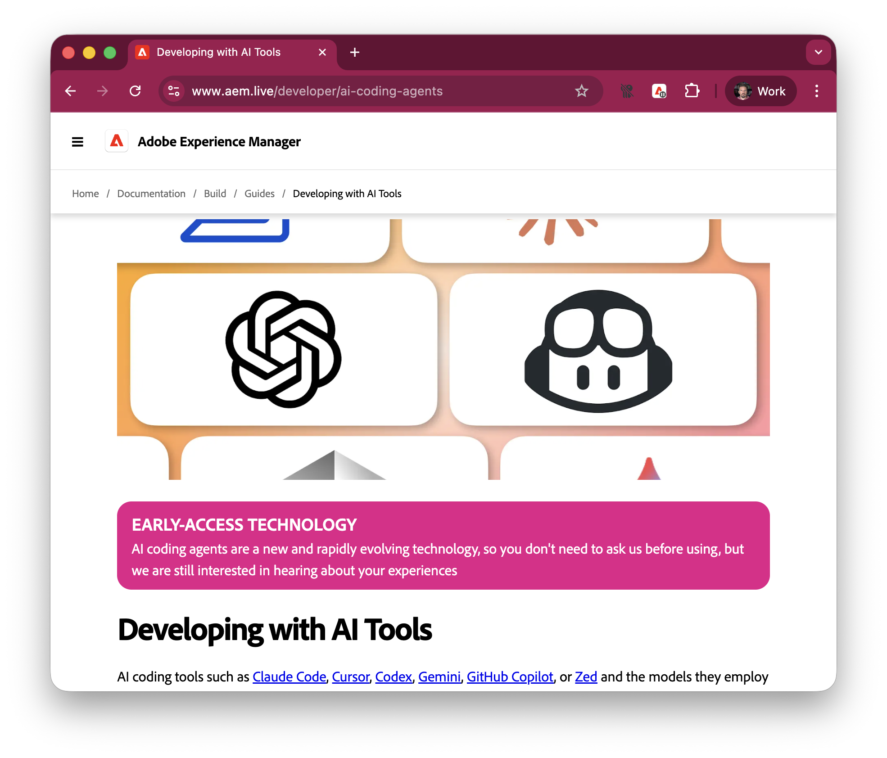

# Say hi to AI

```banner
AI
```

---

# And AI says hi to you

```bash +exec
./copresenter --new "Say hi to the Adobe Developers Live audience"
```

---
# Not just any kind of AI

```banner +animate:rainbow +loop
Agentic
```
---

# What

- Smarter autocomplete
- Chat with your code base, ask questions
- Agents in your IDE
- __Standalone agents in your CLI__ (we are here)
- Standalone agents in the cloud

---
```bash +exec
./copresenter "Got anything to add?"
```

---

```ascii
┌──────────────────────────────────────────────────────────┐
│                        CLOUD                             │
│                  ┌──────────────────┐                    │
│                  │   Claude Model   │                    │
│                  │   (Sonnet 4.5)   │                    │
│                  └────────▲─────────┘                    │
└───────────────────────────┼──────────────────────────────┘
                            │ API calls
┌───────────────────────────┼──────────────────────────────┐
│                  LOCAL ENVIRONMENT                       │
│                  ┌────────▼─────────┐                    │
│                  │  Agent Harness   │                    │
│                  │ (orchestration)  │                    │
│                  └────────┬─────────┘                    │
│         ┌─────────────────┼─────────────────┐            │
│         │                 │                 │            │
│    ┌────▼─────┐     ┌─────▼─────┐      ┌────▼─────┐      │
│    │ File I/O │     │   Bash    │      │   MCP    │      │
│    │  Tools   │     │   Tools   │      │ Servers  │      │
│    └────┬─────┘     └─────┬─────┘      └────┬─────┘      │
│         └─────────────────┼─────────────────┘            │
│                   ┌───────▼─────────┐                    │
│                   │  Your Codebase  │                    │
│                   │  & Environment  │                    │
│                   └─────────────────┘                    │
└──────────────────────────────────────────────────────────┘
```

---

```bash +exec
./copresenter "Remind me what MCP stands for"
```

---

# Edge Delivery Services

```banner:graceful
aem.live
```

---

# https://www.aem.live/ai




---

# AGENTS.md

```banner:mini +animate:scanner +loop
AGENTS.md
```

---

```ascii +animate:typewriter +once
┌────────────────────┐          ┌────────────────────┐
│                    │          │                    │
│    ~/AGENTS.md     │          │    ./AGENTS.md     │
│~/.claude/CLAUDE.md │          │    ./CLAUDE.md     │
│                    │          │                    │
└────────────────────┘          └────────────────────┘
           │                               │
           │                               │
           └────injected into (almost) ────┘
                     every  prompt
                          │
                          ▼
                     ┌─────────┐
                     │ Coding  │
                     │  Agent  │
                     └─────────┘
```

---

# If you don't like repeating yourself

- default prompt for every project (~) or the current repository
- or even the current folder
- put all the things the agent should always follow here

https://github.com/adobe/helix-website/blob/main/AGENTS.md

(steal this)

---

```bash +exec
./copresenter "Hey, why does every agent but Claude respect AGENTS.md?"
```
---

# SKILLS.md

```banner:mini +animate:neon +loop
SKILLS.md
```

---

```ascii +animate:matrix
         ┌────────────────────────────────────┐
     ┌───│  .claude/skills/search/SKILLS.md   │
     │   └────────────────────────────────────┘
     │       ┌────────────────────────────────────┐
     ├───────│   .claude/skills/test/SKILLS.md    │
     │       └────────────────────────────────────┘
     │           ┌────────────────────────────────────┐
     ├───────────│    .claude/skills/pr/SKILLS.md     │
     │           └────────────────────────────────────┘
     │
     ▼
┌─────────┐
│ Coding  │ list skills at start of
│  Agent  │ session, load on demand
└─────────┘
```

---

# What skills can do

- make your agent more __skilled__
- are used on-demand
- don't consume *context* by default

<!--

Note: context is the hard currency of coding agents. you want to preserve them,
protect them, and use them wisely.

-->
---

```bash +exec
./copresenter "Kudos to team Anthropic for inventing SKILLS.md. Do other agents respect SKILLS.md?"
```
---

# Upskill

```bash
$ gh ext install trieloff/gh-upskill
$ gh upskill adobe/helix-website
```

Install skills from another repository, for any agent that respects `AGENTS.md`

---

# `--dangerously-skip-permissions`

```banner:block +animate:glitch +loop
YOLO
```

---

```ascii +animate:fire +loop
  /\/\/\/\/\/\/\/\/\/\/\/\/\/\/\/\/\/\/\/\/\/\/\/\/\/\/\/\/\/\/\
  ////////////////////////// DANGER ZONE ////////////////////////
  /\/\/\/\/\/\/\/\/\/\/\/\/\/\/\/\/\/\/\/\/\/\/\/\/\/\/\/\/\/\/\
                                /\
                               /!!\
                              /!!!!\
                             /!!!!!!\
                            /!!!!!!!!\
                            \!!!!!!!!/
                             \!!!!!!/
                              \!!!!/
                               \!!/
                                \/
  /\/\/\/\/\/\/\/\/\/\/\/\/\/\/\/\/\/\/\/\/\/\/\/\/\/\/\/\/\/\/\
  ///////////////////////////////////////////////////////////////
```

Skips all permission prompts for file operations (and this is where the _fun_ begins)

---
## Normal operations

The agent will ask for permission for any potentially sensitive, or destructive operation.

## How you will feel

Assured, and bored.

## Escape the sandbox

> Or have you ever seen a cowboy wear a seatbelt to the rodeo?

---

```banner +animate:fire +loop
HERZBLUT
```

---
# Entschuldigung, was ist Herzblut?

```ascii +animate:breathe +loop
       ♥♥♥♥♥       ♥♥♥♥♥
     ♥♥     ♥♥   ♥♥     ♥♥
    ♥♥       ♥♥ ♥♥       ♥♥
    ♥♥                   ♥♥
     ♥♥                 ♥♥
      ♥♥               ♥♥
       ♥♥             ♥♥
         ♥♥         ♥♥
           ♥♥     ♥♥
             ♥♥ ♥♥
               ♥
```

**Herzblut** (German): *lifeblood, passion, heart and soul*

When you code without an AI agent, you're not just writing code—you're infusing it with your vision, your standards, your *Herzblut*. You feel passionate about every detail of the code.

When coding with an AI agent, __drop that attitude__, it won't do you no good. The agent is a tool, an so is the code it produces.

---

# Multitasking/Multi-Clauding

```banner:ogre +animate:fire
PARALLEL
```

---

```ascii +animate:matrix
┌─────────────────┐  ┌─────────────────┐  ┌─────────────────┐
│   Terminal 1    │  │   Terminal 2    │  │   Terminal 3    │
│                 │  │                 │  │                 │
│  $ claude       │  │  $ codex        │  │  $ gemini       │
│  Building...    │  │  Testing...     │  │  Documenting... │
│                 │  │                 │  │                 │
│  [████░░] 60%   │  │  ✓ 47 passed    │  │  Writing API    │
│                 │  │  ⚠ 2 warnings   │  │  docs...        │
└─────────────────┘  └─────────────────┘  └─────────────────┘
         │                    │                    │
         └────────────────────┼────────────────────┘
                              │
                    ┌─────────▼──────────┐
                    │   Same Codebase    │
                    │  Different Tasks   │
                    └────────────────────┘
```

---

# Why run multiple agents?

- **Different tasks in parallel**: Build, test, document simultaneously
- **Different branches**: Work on features while fixes run in main
- **Context isolation**: Each instance focuses on one specific task
- **Faster iteration**: Don't wait for one task to finish before starting another

---

# Git Worktrees

```banner:small +animate:matrix +loop
WORKTREE
```
---


---

```ascii +animate:matrix
                    main repo (.git)
                          │
            ┌─────────────┼─────────────┐
            │             │             │
         claude-1      codex-2        gemini-3
         (main)        (feature-a)   (feature-b)
            │             │             │
         ┌──▼──┐       ┌──▼──┐       ┌──▼──┐
         │ 📁  │       │ 📁  │       │ 📁  │
         │ src │       │ src │       │ src │
         └─────┘       └─────┘       └─────┘
           │             │             │
        claude         codex        gemini
       instance 1    instance 2    instance 3
```

---

# What are Git Worktrees?

Multiple working directories attached to the same repository
- Each worktree can check out a different branch
- Share the same `.git` database (efficient!)
- Work on multiple features/branches simultaneously

# Why They're Perfect for Agents

- Run multiple agents on different branches
- No context switching or stashing required
- Agents can work in parallel without conflicts
- Test features independently while keeping main clean

---

```bash
$ aem up
```

# Automatic Worktree Detection

`aem up` automatically detects when it's launched in a Git worktree and will pick a non-conflicting port: run as many dev servers as you have worktrees. Since version 16.12.0 (2025-09-16)

---

```bash +exec
./copresenter "What's your favorite aspect about multi-clauding, my little agentic friend?"
```

---

# Seeing like an Agent

```banner:epic +animate:fire +once
OBSERVE
```

---

```ascii +animate:prism +loop
    .-"-._.-"-._.-"-._.-"-.
   /                       \
  |   .-----------------.  |
  |   |  .-----------. |   |
  |   | |    * * *   | |   |
  |   | |   /  |  \  | |   |
  |   | |  /___|___\ | |   |
  |   | '-----------'  |   |
  |   '----------------'   |
   \    Agent Vision      /
    '-._.-"-._.-"-._.-"-'
```
---

```bash +exec
./copresenter "What's that last slide supposed to mean?"
```

---

## Coding Agents are (mostly) text-based

- **Source code**: naturally
- **CLI**: very well
- **CLI background tasks**: emerging support (Claude is great at that)
- **TUI**: early support (`gemini`), but still buggy
- **Image inputs**: mixed: some have it, some don't, but it's always consuming lots of context
- **GUI Apps**: no. not yet, at least

To help your agent, see what you see, turn the vision challenge into a coding challenge.

---

# In AEM

```bash
$ aem up --forward-browser-logs
```

Since version 16.13.0 (2025-09-16), `aem` can forward browser logs to the console, so agents can see them.

# Web Development

Use `puppeteer` or `playwright`, and instruct your agent to write throw-away scripts to test and capture the page.

---

```bash +exec
./copresenter "In your impartial option, which one is better for web development: puppeteer or playwright?"
```


---

# Guardrails/Attribution/Transparency

```banner +animate:breathe +loop
SAFETY
```
---

# Guardrails/Attribution/Transparency

```ascii +animate:matrix
┌────────────────────────────────────────┐
│                                        │
│                 GitHub                 │
│                                        │
└─────────▲─────────────────────▲────────┘
          │                     │
┌─────────┴───────┐    ┌────────┴────────┐
│    ┏━━━━━━━━┓   │    │    ┏━━━━━━━┓    │
│    ┃        ┃   │    │    ┃       ┃    │
│    ┃   gh   ┃   │    │    ┃  git  ┃    │
│    ┃        ┃   │    │    ┃       ┃    │
│    ┗━━━━━━━━┛   │    │    ┗━━━━━━━┛    │
│  ai-aligned-gh  │    │ ai-aligned-git  │
└─────────────────┘    └─────────────────┘
         ▲                      ▲
         │                      │
         │     ┌─────────┐      │
         │     │ Coding  │      │
         └─────│  Agent  │──────┘
               └─────────┘
```

---

## Guardrails/Attribution/Transparency

When making changes on github.com (commits, comments, pull requests), attribute them to AI.

This helps reviewers not waste their "Herzblut" on your vibe-coded output.

- https://github.com/trieloff/ai-aligned-gh
- https://github.com/trieloff/ai-aligned-git

---

# Agent/Model table

```banner +animate:glitch +once
COMPARE
```

---

| Agent | Model |
|-------|-------|
| `claude` | claude-opus-4.1 |
| `codex` | gpt-5-high |
| `gemini` | gemini-2.5-pro |
| `copilot` | claude-haiku-4.5 |
| `cursor-agent` | composer 1 |
| `opencode` | Grok Code Fast 1 |
| `qwen` | qwen3-coder-plus-2025-09-23 |
| `droid` | Droid Core (GLM 4.6) |
| `amp` | sonnet-4.5/gpt-5 |
| `kimi` | kimi-k2 |
| `crush` | GLM-4.6 |
| `goose` | gpt-oss-120b |

---

```banner:epic +animate:matrix +once
STOP
DEMO
TIME
```

---

```bash +exec
./copresenter "How long do you think, did it take to set up these agents?"
```
